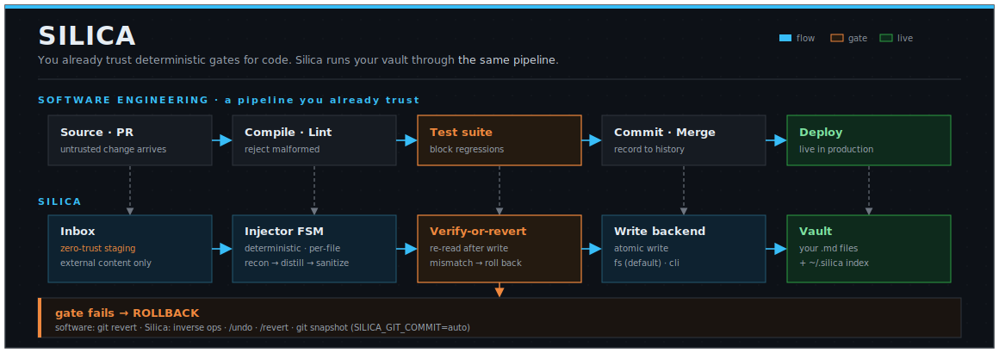

# Silica

[](https://www.python.org/)
[](https://obsidian.md/)
[](https://opensource.org/licenses/AGPL-3.0)
[](https://github.com/astral-sh/uv)

<p align="center">
  
</p>

<h3 align="center">AI that knows the shape of your entire vault, and edits it without ever corrupting it.</h3>

<p align="center">
Silica builds a live model of your notes with <i>embeddings, co-occurrence, the link graph</i>, so the LLM answers from what you actually have, and every edit passes a state machine that verifies-or-reverts and keeps links graph-safe.<br/>
<b>It knows your vault before you say a word.</b> Local-first · Obsidian-compatible.
</p>

<!-- TODO(demo): GUI is the hero GIF above the fold → docs/assets/demo.gif
     Chat-first flow (~15s): grounded answer → curation/ingest → the gate catching a bad edit.
     TUI (asciinema) and Obsidian-plugin clips live in the Interfaces section. -->

> **License:** AGPL-3.0-or-later · *strong copyleft*. Copying any part obliges your whole project to AGPL, including network-only use (§13). [Details below](#license).

---

## Table of Contents
- [How it works in one breath](#how-it-works-in-one-breath)
- [Four ways to run Silica](#four-ways-to-run-silica)
- [Quick Start](#quick-start)
- [Interfaces](#interfaces)
- [What Silica is / is not](#what-silica-is--is-not)
- [Silica for codebases](#silica-for-codebases)
- [Design contracts](#design-contracts)
- [REPL Commands](#repl-commands)
- [Features](#features)
- [Configuration](#configuration)
- [Status](#status)
- [Contributing](#contributing)
- [References](#references)
- [License](#license)

---

## How it works in one breath

Silica keeps a live model of your vault separate from your files: the semantic embeddings, the co-occurrence of concepts, and the wikilink graph. That one model does two jobs at once:

- **It knows what you have.** Before you describe anything, the agent already sees the *shape* of your vault: its hubs, clusters, bridges, and the notes nearest to your question. Answers come from what's actually there, not from thin air.
- **It edits without breaking it.** "Coherence" doesn't live in any single file's bytes; it lives in the graph *between* files. Because Silica models that graph, it can catch the edit that orphans a note or breaks a link, and undo it. The same model that lets it read your vault is what stops it from wrecking your vault.

### Why guardrails, not trust

You already let deterministic tools rewrite and reject your work every day. You don't extend them trust; you trust the guardrail. Silica wraps an LLM's edits to your vault in the same kind of guardrail:

| You already let a deterministic tool… | to guard against… | Silica does the same for a vault by… |
| :--- | :--- | :--- |
| a **compiler** reject source that won't build | syntax and type errors | an FSM refusing to commit a note that fails its structural checks |
| a **test suite** block a merge that breaks behavior | regressions | a post-write **verify gate** that reverts any edit which breaks vault coherence |
| **git** roll back a bad commit | losing history | `/undo` and `/revert` rolling back an injection, per-note or per-run |
| a **formatter** rewrite your code without asking | drift and inconsistency | graph-safe refactors that redirect links so a merge or split never orphans a note |

You don't have to believe anything about the model. You only have to believe that compilers and test suites exist, and that the same discipline can wrap a knowledge base.

<p align="center">
  
</p>

### Why not just point an LLM at your notes?

That's the shape most "chat with your vault" tools take: an open-ended agent with a write key, pointed at your files, hoping the edits are good. The failure is quiet and expensive: a merge that orphans a note, a rewrite that breaks a wikilink, a near-duplicate of a concept you already had. You find out weeks later, and `git revert` can't help, because the damage is in the graph between files, not in any one file's bytes.

Silica refuses that shape. There is no open-ended loop holding a key to your vault. Every mutation goes through the Injector FSM: the agent proposes, the machine gates, you confirm, and the write is re-read and reverted if it broke coherence. Run git *alongside* Silica: git is the byte-level backstop, Silica is the coherence layer on top. Belt and suspenders.

---

## Four ways to run Silica

The same vault model serves four different drivers. What changes is who holds
the write key, and whether they read or write:

1. **You curate, the machine gates.**
   Drive Silica from the REPL, the web GUI, or the Obsidian plugin. You propose
   the ingest, merge, or refactor; the FSM checks it and reverts anything that
   breaks coherence. Your second brain, with a compiler in front of it.

2. **A coding agent grounds itself in your codebase.**
   Point Silica at a repo and it keeps a living, human-readable map of the code
   under `docs/silica/`. A coding agent reads that map over the
   [MCP server](#mcp-server-silica-as-agent-memory) to work from the real
   structure instead of re-deriving it every session: faster, cheaper, fewer
   wrong assumptions. See [Silica for codebases](#silica-for-codebases).

3. **An assistant answers from what you actually know.**
   Any MCP client recalls from your prose vault before it answers, grounding on
   your real notes and decisions instead of guessing. The agent stops spending
   turns on *where and how do I look*; it only asks *what do I need next*.

4. **An autonomous loop remembers safely.**
   A free-running agent can write back too: it captures what it learned, and
   every write still passes the same FSM gate and reverts on mismatch, exactly
   like the human path. A loop holding a write key is bounded by the same
   guardrail you are, not by trust in the model.

Maturity differs per path (the MCP server and REPL ship today; robustness under
crash is still being hardened): see [Status](#status).

---

## Quick Start

### Installation

Clone the repository and install it in editable mode:

```bash
git clone https://github.com/kiycoh/silica-agent.git
cd silica-agent
uv pip install -e .
```

Optional features are installed as extras, alone or combined (`'.[gui,pdf]'`):

```bash
uv pip install -e '.[gui]'      # web GUI (`silica --gui`): FastAPI + SSE chat interface
uv pip install -e '.[pdf]'      # PDF ingestion via mineru (pulls torch; docling/opendataloader are manual alternatives, see SILICA_PDF_PROVIDER)
uv pip install -e '.[mcp]'      # stdio MCP server (`silica mcp`): Silica as agent memory
uv pip install -e '.[connect]'  # Obsidian plugin bridge (`silica connect`)
uv pip install -e '.[dev]'      # tests and linters (pytest, mypy, import-linter)
```

### Setup

Run the interactive wizard. It writes your `.env` (vault, backend, chat provider, embeddings) and finishes with a diagnostic report:

```bash
uv run silica init
```

Re-check the environment at any time:

```bash
uv run silica doctor
```

### Execution

Start the interactive REPL:

```bash
uv run silica
```

A good first move on an existing vault is a read-only structural audit. It never writes, and it shows you the hubs, bridges, and orphans before you touch anything:

```
/report
```

Then run the ingestion pipeline from inside the REPL:

```
/ingest Inbox/note.md --target=Concepts/AI
```

### MCP server (Silica as agent memory)

`silica mcp` serves the vault over stdio to any MCP client: semantic/text search, note reading, and gated single-note writing (12 tools; `--all` exposes the full toolset). For Claude Code the repo is also a plugin: one install wires the MCP server **and** the `silica` skill (the recall-before-answering / capture-after-learning loop):

```bash
claude plugin marketplace add /path/to/silica-agent   # or the GitHub repo
claude plugin install silica@silica
```

To wire only the MCP server, without the skill:

```bash
claude mcp add silica -- uv run --project /path/to/silica-agent --with mcp silica mcp
```

The vault resolves like the REPL: `SILICA_VAULT` if set (add `-e SILICA_VAULT=/path/to/vault` to pin one), else from the client's working directory, so a project repo gets its `docs/silica`. Requires the `[mcp]` extra (`uv pip install -e '.[mcp]'`).

---

## Interfaces

Silica meets you where you work:

- **GUI** (`uv run silica --gui`): a chat-first web interface (FastAPI + SSE) for querying and curating the vault from the browser. It makes the strongest first impression, so it leads the demo above.
- **TUI** (`uv run silica`): the interactive terminal REPL; see [REPL Commands](#repl-commands).
- **Obsidian plugin** (`silica connect`): a live bridge into the Obsidian desktop app. *In progress: feature-complete, pending end-to-end hardening (see [Status](#status)).*

<!-- GIFs (added later): GUI is the hero above the fold; TUI clip via asciinema → agg; Obsidian-plugin clip once hardened. -->

---

## What Silica is / is not

Silica is a CLI-based, FSM-orchestrated agent that manages Obsidian vaults, keeping context of how their pieces relate: co-occurrence, hyperlinks, graph. It is **local-first** (LM Studio, Ollama; OpenRouter also supported) and maintains its vault index **separate from your files**. Codebases, images, and `.pdf`/`.docx`/`.txt` documents are in progress (see [Status](#status)).

It is **not**:

- **Not a "point AI at your notes" button.** Ingestion keeps a human in the loop: the agent proposes, the FSM gates, you confirm.
- **Not a correctness proof.** "Coherence" is a heuristic target enforced by contracts, not a theorem. Silica shrinks the blast radius of a bad edit; it does not guarantee the edit was *semantically* right.
- **Not a backup.** It runs alongside git and your own backups, never in place of them.
- **Not a free-form orchestrator.** No open-ended tool-calling loop over your vault; the state machine is the only way in.

### Example workflows

1. **Automated Inbox Ingestion:** Reads raw clippings and drafts from an inbox directory, distills them into atomic markdown concepts, resolves duplicate matches against the existing vault, and writes them safely.
2. **Conversational Vault Querying:** Query your notes, map paths across the graph, and generate outlines or synthesis documents using semantic search and graph-traversal tools in the REPL.
3. **Graph-Safe Note Refactoring:** Handles complex merges and splits of concept notes, redirecting incoming links automatically to prevent broken references or orphaned files.

---

## Silica for codebases

Point Silica at a repository instead of a note vault (set `SILICA_VAULT` to the repo root; Silica keeps its own files under `docs/silica/`). It builds a living, human-readable description of the codebase and keeps it honest against git.

`/ingest <source-file>` extracts a shallow AST skeleton with tree-sitter (signatures, structure, imports), sanitizes and fences the source-derived text, and stages it in `Inbox/`. The same curation pipeline that refines note drafts turns each skeleton into a markdown note that documents its source files, tagged in frontmatter with `documents:` (the paths it covers) and `code_ref:` (the commit it was last verified against). Your own code takes the same zero-trust ingress as anything else: it never lands straight in the vault.

Two readers, one artifact:

1. **A human** reads `docs/silica/` as an always-current map of the codebase.
2. **A coding agent** reads it over the [MCP server](#mcp-server-silica-as-agent-memory) to ground its work in the codebase's real structure, instead of re-deriving it from scratch every session. Grounded context makes the agent's work faster, cheaper, and less likely to act on a wrong assumption.

Git keeps the docs from drifting: `/stale` flags any note whose documented source changed *structurally* since its `code_ref` (a signature or control-flow change, not just a reformat), and `/impact` maps a set of changed files to the notes they affect through the import graph. You re-curate what actually moved, not the whole tree.

Maturity is honest: see [Status](#status). Skeleton extraction and the staleness/impact tracking ship today; broader auto-generated coverage across more languages is expanding.

---

## Design contracts

Silica is not a free-form agent. Every vault mutation passes through a finite-state machine that enforces these contracts:

- **Single entry point:** all ingestion flows through the Injector FSM. There is no side channel that writes to the vault.
- **Verify-or-revert:** every write is re-read and checked afterward; a mismatch (`VerifyMismatchError`) rolls the write back.
- **Graph-safe moves:** renames, merges, and splits redirect incoming links atomically. No operation leaves a broken reference or an orphan.
- **Zero-trust ingress:** external content (e.g. web search) can only land in `Inbox/`. Nothing reaches the vault without explicit human staging and FSM review.
- **Layered rollback:** `/undo` (per note), `/revert` (per run), and optional `SILICA_GIT_COMMIT=auto` stack as independent safety nets.

The full schematic (interfaces, agent loop, ingress adapters, the Injector FSM state sequence, the kernel, write backends, and persistence):

<p align="center">
  
</p>

> **Honesty note.** These are enforced *today* by the FSM on the normal write path. They are not yet *crash-verified*: a chaos harness that kills the process mid-write to prove the invariants survive failure is [in progress](#status). Trust the contracts for what they are: enforced control flow, not a formal proof under adversarial faults.

---

## REPL Commands

**Workflow** (agent-directed):

| Command | Usage | Description |
| :--- | :--- | :--- |
| `/report` | `[folder] [--top-k=N] [--embeddings]` | Structural audit of the vault (hubs, bridges, orphans). Pauses for confirmation. |
| `/ingest` | `<file...> [--target=DIR] [--hub=H]` | Bring files in: notes via Injector FSM, code as skeleton stubs. Without `--target` the agent picks the most relevant vault folder for the run |
| `/organize` | `"<intent>" [--scope=FOLDER] [--file=taxonomy.yaml] [--merge] [--move-uncategorized] [--apply]` | Classify and reorganize vault notes according to a taxonomy |
| `/summarize` | `<note\|folder...>` | Read-only digest of one or more notes in chat (key points, tables) |
| `/explain` | `"<concept>" [--level=intro\|expert]` | Explain a concept grounded in the vault, at the chosen register (read-only) |
| `/compare` | `"<A>" "<B>" [...]` | Comparison table of notes/concepts; surfaces contradictions (read-only) |
| `/quiz` | `<note\|folder> [--n=10]` | Active-recall quiz from notes: questions first, answers keyed below (read-only) |
| `/relate` | `<note> [--n=8]` | Typed relationship map: how/why one note relates to its vault neighbors (read-only) |

**Direct** (immediate, no LLM round-trip):

| Command | Usage | Description |
| :--- | :--- | :--- |
| `/status` | `[run_id]` | Progress digest of the last run |
| `/convert` | `<file...> [--target=DIR]` | Transcode a non-`.md` file (PDF) into a markdown note in the inbox |
| `/web-search` | `"<concept>" [--max-searches=N]` | Research a concept on the web → cited findings note in the Inbox (then `/ingest`) |
| `/embed` | `[folder] [--force]` | Build/update the embedding index |
| `/cooccur` | `[folder] [--force]` | Build/update the co-occurrence index (no embedder needed) |
| `/graph` | `[out.html] [folder]` | Export the knowledge graph |
| `/map` | `<nota> [--force]` | Radial mind-map rooted on a note → `maps/<stem>.canvas` |
| `/find` | `<query> [--k=N]` | Semantic search |
| `/undo` | `[note-path]` | Undo the last patch on a note |
| `/review` | `[--flush=HASH]` | Inspect the async review queue (deferred ops) |
| `/revert` | `[run-id]` | Revert a whole injection (per-run, LIFO) |
| `/dedup` | `[folder]` | Deduplicate notes (sub-agent) |
| `/curate` | `[folder] [--apply]` | Curate the vault: plan autolink/orphan/dedup/refine work (dry-run; `--apply` executes) |
| `/refine` | `[folder]` | Enrich and normalize notes (sub-agent) |
| `/enrich` | `[folder]` | Enrich note semantics (sub-agent) |
| `/stale [--all]` | | List notes whose `documents:` sources changed structurally since `code_ref` (`--all` includes cosmetic body-only changes) |
| `/impact [<range>]` | | Changed files → affected notes (documenting + 1-hop import neighbors); no range = uncommitted changes |
| `/plans` | | List `plans/` notes grouped by `status:` |
| `/path` | `<noteA> <noteB>` | Shortest reading path between two notes (wikilinks + co-occurrence) |
| `/contested` | | List notes flagged `contested: true` with their unresolved contradictions |

**System:** `/help` · `/model` · `/tools` · `/clear` · `/verbose` · `/thinking` · `/vault [path]` (show or switch the active vault for this session) · `/settings [<key> <value|none>]` (view or edit vault.yaml settings) · `/exit`

---

## Features

* **Token-Efficient Vault Auditing (`/report`):** Computes community-detection clusters (Louvain modularity), god-nodes (high-degree hubs), structural bridges (inter-community connectors), and orphans, then builds a full structural remediation plan for a vault of **1,000+ markdown files in under 10 seconds**.
* **Parallel Worker Sub-Agents:** Cognitive-heavy batch operations like semantic deduplication (`/dedup`) and detail refinement (`/refine`, `/enrich`) are offloaded to leashed sub-agents. These run concurrently (up to `SILICA_SUBAGENT_MAX_CONCURRENT`) on a separate worker model (`SILICA_WORKER_MODEL`), keeping the main model's context window clean.
* **Embedder-Free Concept Modeling:** If an embedding model is offline or unconfigured, concept matching degrades gracefully to a deterministic, local co-occurrence graph (`/cooccur`), querying relatedness and labeling communities in `/graph` exports with no network calls or LLM queries.
* **No-Loss Bulk Ingestion:** `/ingest` takes as many files in one call as you have, 20 or more depending on their informational density, without degrading. Each source file is chunked deterministically by size, not truncated or summarized away, so the model never has to hold more than one bounded chunk in context at a time. No more splitting a batch into small hand-fed sessions because "too many files confuse it."

---

## Configuration

Configure the agent via environment variables (e.g., in a `.env` file). `silica init` writes the essentials for you; the full list with defaults lives in [`.env.example`](.env.example).

| Variable | Description |
| :--- | :--- |
| `SILICA_MODEL` | Chat LLM model identifier (litellm format, e.g. `openrouter/anthropic/claude-sonnet-4-20250514`) |
| `SILICA_PROVIDER` | Chat provider preset: `lmstudio` or `openrouter` |
| `OPENROUTER_API_KEY` | Required when the provider is `openrouter` |
| `SILICA_VAULT` | Vault path. An Obsidian vault (`.obsidian/`) is used verbatim; any other path is repo mode → `docs/silica/` |
| `SILICA_BACKEND` | `fs` (headless filesystem, default) or `cli` (live Obsidian desktop via CDP; adds rollback + live cache) |
| `SILICA_EMBEDDING_MODEL` | Embedding model identifier used for semantic tasks (default: `qwen3-embedding-4b`) |
| `SILICA_WORKER_MODEL` | Sub-agent worker model (e.g., a small local model for dedup / refinement) |
| `SILICA_GIT_COMMIT` | Git commit safety net for vault writes (`off`, `auto`) |
| `SILICA_TAVILY_API_KEY` | API key for Tavily search (enables the `/web-search` command) |

---

## Status

Silica is under active development. This is where it honestly stands:

- **Available now:** Obsidian vault ingestion (notes), structural audit (`/report`), semantic (`/find`) and embedder-free co-occurrence search, graph-safe refactor / dedup / merge, codebase documentation via shallow-AST skeleton extraction with git-backed staleness (`/stale`) and impact (`/impact`) tracking, git safety net, layered `/undo` and `/revert`, the MCP server (`silica mcp`) with the Claude Code plugin packaging.
- **In progress:** richer codebase documentation (auto-generated coverage beyond per-file skeletons, more languages), PDF/DOCX/TXT ingestion, the live Obsidian bridge (`silica connect`, feature-complete but pending end-to-end hardening), and the crash/chaos harness backing the [design contracts](#design-contracts).
- **Planned:** image ingestion and MCP/skill packaging for non-Claude coding agents.

Distinguish carefully: what ships today is enforced; what's listed above as in-progress or planned is not yet present.

---

## Contributing

Issues and pull requests are welcome. See [CONTRIBUTING.md](CONTRIBUTING.md) for the dev setup, the test command, and the conventions (English-only, conventional commits). By contributing you agree your work is licensed under AGPL-3.0-or-later. To report a security issue, follow [SECURITY.md](SECURITY.md); do not open a public issue.

---

## References

*   **[From Agent Loops to Structured Graphs: A Scheduler-Theoretic Framework for LLM Agent Execution](https://arxiv.org/abs/2604.11378)** (arXiv:2604.11378, 2026)
*   **[Goal-Autopilot: A Verifiable Anti-Fabrication Firewall for Unattended Long-Horizon Agents](https://arxiv.org/abs/2606.11688)** (arXiv:2606.11688, 2026)
*   **[Is Your Agent Playing Dead? Deployed LLM Agents Exhibit Constraint-Evasive Fabrication and Thanatosis](https://arxiv.org/abs/2606.14831)** (arXiv:2606.14831, 2026)
*   **[Reliable Graph-RAG for Codebases: AST-Derived Graphs vs LLM-Extracted Knowledge Graphs](https://arxiv.org/abs/2601.08773)** (arXiv:2601.08773, 2026)
*   **[Predicting new research directions in materials science using large language models and concept graphs](https://doi.org/10.1038/s42256-026-01206-y)** (*Nature Machine Intelligence*, 2026)

Silica's embedder-free near-duplicate detection (`/dedup`) is inspired by and ports the well-thought-out MinHash design from [Graphify](https://github.com/safishamsi/graphify).

---

## License

This project is licensed under the **GNU Affero General Public License v3.0** (AGPL-3.0-or-later).
Copyright (C) 2026 Alessandro Carosia.

AGPL-3.0 is a **strong copyleft** license. In practice, if you incorporate any portion of Silica (whole modules or individual functions) into another work:

- that work becomes a *derivative* and **must itself be licensed under AGPL-3.0**;
- its **complete corresponding source** must be offered to everyone who uses it;
- **§13** extends this to network use: running a modified version as a hosted service obliges you to
  provide that source to your users, even without distributing any binary.

There is no permissive fallback. If your project cannot comply with these terms, you do not have a
license to use this code. Every source file carries an `SPDX-License-Identifier: AGPL-3.0-or-later`
header; removing it does not remove the obligation.

See [LICENSE](LICENSE) for the full text.
