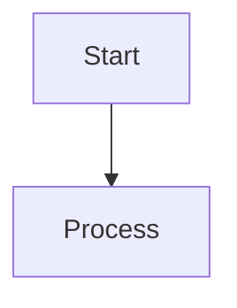

# Obsidian Refiner — Refinement Pipeline

The Refinement pipeline processes an entire `<TARGET_FOLDER>` of notes in batch.
Each note is triaged into one of four categories and handled accordingly:

| Category | Condition | Action |
|---|---|---|
| **Decouple** | Over size limits AND ≥ 2 H2 headings | Split into Hub + atomic Spokes |
| **Reformat** | Normal size, has frontmatter tag issues | Deterministic YAML tag normalization |
| **Enrich** | Empty or lean (< 600 chars) | Normalize tags + queue for LLM web enrichment |
| **OK** | Well-formed, adequate content | Skip |

## Inputs

- `<TARGET_FOLDER>` — folder containing notes to refine (processed recursively).
- `<HUB_NAME>` (optional, in prompt) — override hub name for all decoupled notes. If omitted, the hub name is derived from each monolith's filename (e.g. `Backpropagation.md` → Hub: "Backpropagation").

## Required Tools

This skill requires:
- **`web_search` & `web_extract`** (native tools called directly by the model) for enriching lean notes.
- **`write_file` & `patch`** (native file operation tools) to commit updates to the vault.

## Pipeline Phases

### Phase 1 — Discovery & Planning (`execute_code`)

Run the batch triage + deterministic ops generator:
```bash
python3 <REFINER_SCRIPTS_DIR>/batch_refine.py --folder "<TARGET_FOLDER>"
```

This script:
1. Iterates all `.md` files in `<TARGET_FOLDER>` (recursive)
2. Runs `inspect()` on each note
3. Triages into `decouple` / `reformat` / `enrich` / `ok`
4. For `decouple`: generates split ops (Hub index + Spokes) via `build_ops()`
5. For `reformat`: generates YAML normalization ops via `normalize()`
6. For `enrich`: normalizes tags first, then queues for LLM

**Outputs**:
- `/tmp/deterministic_ops.json` — bulk_writer ops array (splits + normalizations)
- `/tmp/enrich_queue.json` — list of `{path, title, char_count, is_empty}` for the Router

**Dry-run mode** (triage only, no ops files):
```bash
python3 <REFINER_SCRIPTS_DIR>/batch_refine.py --folder "<TARGET_FOLDER>" --dry-run
```

### Phase 2 — Deterministic Execution (`execute_code`)

Apply all mechanical operations:
```bash
python3 <COMMON_DIR>/bulk_writer.py --operations /tmp/deterministic_ops.json
```

### Phase 3 — Semantic Enrichment (Router/LLM)

Read `/tmp/enrich_queue.json`. For each entry:
1. `web_search` the note title + domain context (e.g. `"Backpropagation reti neurali"`).
2. `web_extract` the best authoritative URLs; pull definitions, formulas, examples.
3. Synthesize a formal Italian body, **preserving** all existing factual content (anti-deletion policy). Set `AI: true` in frontmatter.
4. Append an `overwrite` op to `/tmp/enrich_ops.json`.

Then execute enrichment writes:
```bash
python3 <COMMON_DIR>/bulk_writer.py --operations /tmp/enrich_ops.json
```

### Phase 4 — Validation (`execute_code`)

Lint all modified files:
```bash
python3 <COMMON_DIR>/linter.py --operations /tmp/deterministic_ops.json
python3 <COMMON_DIR>/linter.py --operations /tmp/enrich_ops.json
```

> [!NOTE]
> The `--hub` flag is optional. When omitted, the linter reads each operation's `hub` field directly from the ops JSON for per-file wikilink validation. This supports batch mode with multiple distinct hubs.

**[EMOTION PROMPT: Do not trust optimistic linting. Scrutinize the linter's output for atomicity violations, tag malformations, or orphaned wikilinks. Note: High-density academic enrichment may trigger 'Note too long' warnings; prioritize factual completeness over strict line limits, but ALWAYS fix 'Missing wikilink' errors. If a critical failure occurs, intercept and halt. Rigor over speed.]**

---

## Differences from obsidian-injector

### In Decouple Mode:
- **Phase 1**: Parse the monolith's headings as candidate concepts (skip `find` step).
- **Phase 2**: Router maps concepts. The monolith itself matches the H1 title (which becomes the Hub).
- **Phase 3**: Write Spokes first (atomically, with `[[Hub title]]` link), then overwrite the Hub note with the Spoke index.

### In Reformat & Enrich Mode:
- **Phase 1**: Inspect the note's frontmatter and body. Check if the note is empty or contains **fewer than 600 characters** (< 600 chars).
- **Phase 2**: Check for missing context, empty bodies, and badly formatted YAML tags (e.g. camelCase, uppercase, spaces, or missing values).
- **Phase 3**: Reformat the YAML frontmatter (lowercase, hyphen-separated tags). If the content is too lean or empty, perform `web_search`/`web_extract` to retrieve factual, academic definitions and write a formal Italian body. Overwrite the target note with the polished, enriched version.

## Content Preservation & Deletion Rules

- **Enrichment Trigger**: Any note containing **fewer than 600 characters** (< 600 chars) must be actively enriched and restructured.
- **Anti-Deletion Policy**: Deleting existing information is **strictly discouraged** unless:
  1. The information is pure semantic/formatting noise.
  2. The model is rewriting/expanding that same concept in a more thorough, detailed, and academically rigorous manner.
  3. The model has verified via `web_search` that the original phrase, definition, or formula is factually incorrect.

## Hub/Target Note Rewrite Constraint

Hub rewrites use full `write_file`, never `patch`. This is the one case
where the Router overwrites existing content. The original monolith body
is preserved in the Spokes; only the Hub structure changes.

## External Enrichment (`web_search` + `web_extract`)

Invoked **only in Enrich mode** (Phase 3), and only when `batch_refine.py` queues
the note as lean (`is_lean: true`, < 600 chars) or empty. Decouple mode and
deterministic YAML normalization never call the web.

### Tool contract (native Hermes `web` toolset)
- `web_search(query)` — ranked results via the configured `web.search_backend`. Responses
  carry a success envelope; on `{"success": false}` or empty results, **do not fabricate** —
  proceed with the note's existing content plus the deterministic Reformat fixes only.
- `web_extract(url[, ...])` — readable content from one or more URLs via `web.extract_backend`.
  Prefer extracting the top 1–3 authoritative results (official docs, papers, standards)
  over relying on search snippets.

### Backend requirement (hard)
`web_extract` needs an extract-capable backend: `firecrawl`, `tavily`, `exa`, or `parallel`.
`searxng` is **search-only** and returns a "search-only backend" error on extract. If extract
is unavailable, **degrade gracefully**: fall back to `web_search` snippets for the body and
still apply the deterministic Reformat fixes (frontmatter normalization, OFM restyle). Never
block a reformat because extraction is unconfigured.

---

- **Scripts & Tools**
  - `scripts/batch_refine.py` — Phase 1 orchestrator.
  - `scripts/inspect_note.py` — Single-note diagnostic.
  - `scripts/split_monolith.py` — Decouple mode planner.
  - `scripts/normalize_frontmatter.py` — YAML tag normalizer.
  - `scripts/fix_hub_links.py` — Post-enrichment utility to force-append missing hub wikilinks.
  - `<COMMON_DIR>/bulk_writer.py` — Phase 2/3 bulk mutation executor.
  - `<COMMON_DIR>/linter.py` — Phase 4 validator.

---

## Obsidian Flavored Markdown (OFM) Styling Instructions

Notes must be created and edited using valid Obsidian Flavored Markdown. This section outlines the structural syntax extensions to be utilized:

### 1. Frontmatter & Properties (YAML)
Every note must start with a YAML frontmatter block containing key metadata properties.
- **`tags`**: Note tags (always lowercase and hyphen-separated, e.g. `machine-learning`).
- **`aliases`**: Alternative names for the note.
- **`cssclasses`**: Style classes if needed.
See [PROPERTIES.md](references/PROPERTIES.md) for full types and details.

### 2. Internal Links (Wikilinks)
Use `[[wikilinks]]` for internal notes.
```markdown
[[Note Name]]                          Link to note
[[Note Name|Display Text]]             Custom display text
[[Note Name#Heading]]                  Link to heading
[[Note Name#^block-id]]                Link to block
```

### 3. Embeds
Prefix any wikilink with `!` to embed its content inline:
```markdown
![[Note Name]]                         Embed full note
![[Note Name#Heading]]                 Embed section
![[image.png]]                         Embed image
```
See [EMBEDS.md](references/EMBEDS.md) for PDF, audio, and query embeds.

### 4. Callouts
Use callouts for structured callouts and tips:
```markdown
> [!note]
> Basic callout.

> [!tip] Scholarly Tip
> Helpful hint or context.
```
Common types: `note`, `tip`, `warning`, `info`, `example`, `quote`, `bug`, `danger`, `question`.
See [CALLOUTS.md](references/CALLOUTS.md) for details on folding and type lists.

### 5. Math (LaTeX)
Use LaTeX math blocks for equations:
```markdown
Inline: $e^{i\pi} + 1 = 0$

Block:
$$
\frac{a}{b} = c
$$
```

### 6. Diagrams (Mermaid)
Use Mermaid code blocks for rendering relationships:


---

## Pitfalls
- **Atomicity** — if a Spoke would exceed 40 lines, split further (sub-Spoke or sub-section). Do not loosen the limit.
- **JSON Parsing in execute_code** — `read_file` returns content prefixed with line numbers (`LINE|CONTENT`). When reading ops or queue JSONs in Python, use `terminal(f'cat {path}')` or strip the line prefixes before `json.loads()` to avoid `JSONDecodeError`.
- **Enrichment Timeouts** — Heavy web enrichment tasks can trigger subagent timeouts (600s). If the `enrich_queue.json` is large, partition the tasks into smaller batches (e.g., 3-5 notes per delegation) to ensure completion.
- **Hub Linkback** — Every note (Spoke or Enriched) must contain a `[[Hub Title]]` link in the body (e.g., in a `# Relazioni` section), not just in frontmatter. Subagents often omit this; explicitly demand it in the delegation prompt to prevent linter failures. If subagents omit it, do not re-run enrichment; use a post-processing script to append the link to the bottom of the file.
- **Enrichment vs. Size Limits** — High-density academic enrichment often triggers linter "Note too long/large" warnings. If the content is justified and cohesive, these warnings can be accepted. If the note becomes a monolith, it should be moved to 'Decouple' mode for splitting.
- **No orphans** — never create a Spoke without updating the Hub's index.
  Order operations: write all Spokes first, then rewrite the Hub last with
  the complete Spoke list.
- **Atomicity** — if a Spoke would exceed 40 lines, split further (sub-Spoke
  or sub-section). Do not loosen the limit.
- **Enrich + bad tags overlap** — a lean note may also have malformed YAML tags. `batch_refine.py` handles this by normalizing tags deterministically first, then queuing the note for LLM enrichment. Both actions are applied.
- **Semantic Overlap** — When enriching, you may encounter notes with near-identical titles. Analyze if they represent different theoretical angles (e.g., two different authors on the same topic). If complementary, use bidirectional wikilinks rather than merging.
