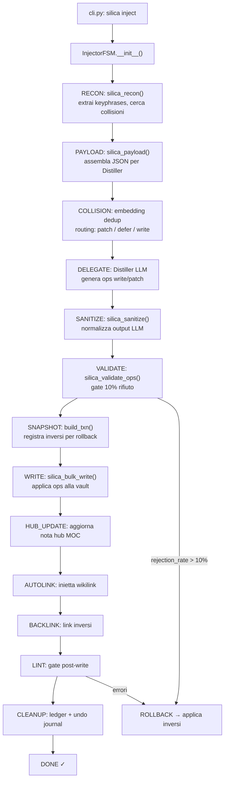

# Silica — Panoramica del Progetto

> **Silica** è un agente CLI nativo per [Obsidian](https://obsidian.md): ingerisce note "grezzo" dall'Inbox, le analizza con un LLM, le normalizza e le scrive nella vault in modo strutturato, con rollback, dedup semantico, autolink e molto altro.

---

## Struttura ad alto livello

```
silica/          ← pacchetto Python principale
├── cli.py           ← entrypoint (comandi: inject, run, dedup, chat…)
├── config.py        ← SilicaConfig singleton (env var + .env)
├── prompts.py       ← system prompt condivisi
├── agent/           ← loop LLM + provider + eventi
├── capabilities/    ← background workers (dedup, enrich, refine, orphan)
├── domains/         ← configurazione per dominio (codebase, legal…)
├── driver/          ← astrazione Obsidian (fs o CLI)
├── kernel/          ← logica core riusabile (embed, validate, bulk, ops…)
├── onboarding/      ← wizard primo avvio e health-check
├── recipes/         ← configurazioni YAML pipeline (injector, refiner, organizer)
├── router/          ← FSM deterministiche (Injector, Refiner, Organizer)
├── sources/         ← adattatori sorgente (markdown, code, PDF…)
├── tools/           ← registry @tool + tool concreti
└── ui/              ← Rich TUI (banner, renderer, logging, comandi REPL)

web/             ← landing page statica (HTML/CSS/SVG)
tests/           ← 100+ test pytest
examples/        ← overlay di esempio + taxonomy
```

---

## Layer 1 — Configurazione e Bootstrap

### `silica/config.py`
**Il singleton `CONFIG`** — letto all'import da variabili d'ambiente (o `.env`).  
Contiene tutti i parametri runtime: modello LLM, vault path, backend driver, soglie di similarità, URL embedder, limiti sub-agent, ecc.  
**È l'unica fonte di verità** per la configurazione; tutti gli altri moduli lo importano, non leggono env-var direttamente.

### `silica/__init__.py`
Espone solo `__version__` (da `setuptools-scm`). Nessuna logica.

---

## Layer 2 — Entrypoint CLI

### `silica/cli.py`
**Il punto d'ingresso principale** (comando `silica`), costruito con [Click](https://click.palletsprojects.com/).

Comandi principali:

| Comando | Cosa fa |
|---|---|
| `silica inject <file> <dir>` | Esegue l'InjectorFSM sulla nota inbox |
| `silica run` | REPL interattiva con l'agente |
| `silica dedup` | Avvia il worker di deduplicazione |
| `silica refine` | Avvia il RefinerFSM |
| `silica organize` | Avvia l'OrganizerFSM |
| `silica init` | Wizard di onboarding |
| `silica vault` | Gestione multi-vault |
| `silica graph` | Esporta/visualizza il grafo della vault |

`cli.py` costruisce i messaggi iniziali, istanzia l'FSM corretto o chiama `run_agent()`, e passa i callback della UI.

---

## Layer 3 — Agent Loop

### `silica/agent/loop.py` ← **Nucleo dell'agente**
Implementa il ciclo `while True` classico degli agenti LLM:
```
LLM(messaggi, tool_schemas) → [tool_calls] → esegui tools → append risultati → repeat
```
Funzionalità chiave:
- **Convergence guard**: se lo stesso tool+args fallisce 3 volte di fila → `RuntimeError`
- **Cancel token**: supporto `threading.Event` per interruzione cooperativa (`Ctrl+C`)
- **Event bus**: emette `ToolStartEvent`, `ToolCompleteEvent`, `ReasoningEvent`… verso la TUI

### `silica/agent/providers.py`
Astrazione LLM: `OpenAICompatibleProvider` (usato per LM Studio e OpenRouter).  
- Supporta **streaming** (path normale) e **structured output** (`client.beta.chat.completions.parse`)  
- Retry automatico su timeout/rate-limit (3 tentativi con backoff esponenziale)  
- `OpenAIEmbedder`: client per l'endpoint `/v1/embeddings`  
- `get_provider(config, role="router"|"worker")`: factory che seleziona il provider giusto in base al ruolo

### `silica/agent/llm.py`
Wrapper sottile che chiama il provider e restituisce `LLMResponse` (dataclass con `text`, `tool_calls`, `reasoning`, `finish_reason`, `usage`).

### `silica/agent/events.py`
Dataclass degli eventi emessi durante il loop: `ToolStartEvent`, `ToolCompleteEvent`, `ToolErrorEvent`, `ReasoningEvent`, `ThinkingStartEvent/End`, `LLMStreamEvent`.

### `silica/agent/bus.py`
**Event bus** pub/sub in-process. La TUI si iscrive ai topic `agent/tool_start`, `agent/tool_complete`, ecc. per renderizzare il progresso in real-time senza accoppiamento diretto.

### `silica/agent/bounds.py`
`AgentConstraints`: definisce i limiti di un sub-agente (tools ammessi, max iterazioni, modello, timeout). Usato dai sub-agent leashed per isolarli dal loop principale.

### `silica/agent/subagent.py`
`BoundedSubAgent`: esegue un sotto-agente con `AgentConstraints` applicate, in un thread separato con timeout e cancel token.

### `silica/agent/compaction.py`
Comprime la cronologia dei messaggi quando il contesto supera `max_context_tokens`, riassumendo i messaggi più vecchi.

### `silica/agent/commit.py`
Git safety net: dopo ogni batch di scritture, se `SILICA_GIT_COMMIT=auto`, fa commit dei file vault toccati.

### `silica/agent/delegate.py`
Logica di delegazione a sub-agenti: prepara il contesto e avvia un `BoundedSubAgent`.

### `silica/agent/concurrency.py`
Gestisce il semaforo globale `worker_slot` per limitare le chiamate LLM concorrenti al valore `SILICA_WORKER_MAX_CONCURRENT`.

### `silica/agent/constraints.py`
Definisce `AgentConstraints` (dataclass leggera, importata da `bounds.py`).

---

## Layer 4 — Tool Registry

### `silica/tools/__init__.py` ← **Registro centrale**
Definisce il decoratore `@tool(ParamsModel, cls=...)` e il dizionario globale `TOOLS`.

```python
TOOLS: dict[str, Tool] = {}

@tool(MyArgs, cls="atomic")
def silica_read_note(name: str) -> str: ...
```

Ogni tool ha:
- **`params_model`**: Pydantic `BaseModel` → validazione input + JSON-schema per il LLM
- **`cls`**: `"atomic"` (1:1 col driver), `"composed"` (pipeline stage), `"wrapped"` (con Golden Rule)
- **`collapse`**: policy di visualizzazione nella TUI (`lazy`/`eager`/`never`)

### `silica/tools/atomic.py`
Tools "atomici" che wrappano direttamente il DRIVER:
`silica_read_note`, `silica_write_note`, `silica_patch_note`, `silica_search`, `silica_list_vault`, ecc.

### `silica/tools/pipeline.py` ← **File aperto nel tuo editor**
Tools che corrispondono alle fasi della pipeline Injector:

| Tool | Fase FSM | Cosa fa |
|---|---|---|
| `silica_recon` | RECON | Estrae keyphrases dalla nota inbox e cerca collisioni nella vault |
| `silica_payload` | PAYLOAD | Assembla il payload per il Distiller, partiziona in chunk se grande |
| `silica_sanitize` | SANITIZE | Valida/normalizza l'output JSON del Distiller |
| `silica_validate_ops` | VALIDATE (gate) | Verifica struttura ops, applica soglia rifiuto 10%, riscrive il file |
| `silica_bulk_write` | WRITE | Esegue le operazioni write/patch/delete in batch nella vault |
| `silica_lint` | LINT (gate) | Linter post-write: verifica struttura OFM della nota modificata |
| `silica_deferred_retry` | — | Riprova la scrittura di ops precedentemente deferite |

### `silica/tools/wrapped.py`
Tools con snapshot/rollback integrato (`build_txn`, `silica_snapshot`, `silica_restore`). Garantiscono che ogni scrittura sia reversibile.

### `silica/tools/composed.py`
Tools composti che orchestrano più operazioni (es. `silica_bulk_write` wrappato con txn).

### `silica/tools/graph.py`
Tools per il grafo della vault: esportazione, visualizzazione, report, community detection.

### `silica/tools/runners.py`
`silica_inject`: il tool "mega" che avvia l'intera InjectorFSM. Usato dall'agente in modalità REPL per innescare un inject.

### `silica/tools/notes.py`
Tools per note speciali: hub, deferred list, orphan list.

### `silica/tools/codedocs_tool.py`
Tool per generare documentazione da codice.

### `silica/tools/delegate_tool.py`
Tool `silica_delegate`: fa eseguire un task a un sub-agente leashed.

---

## Layer 5 — Router / FSM

### `silica/router/orchestrator.py` ← **InjectorFSM**
La **macchina a stati deterministica** per la pipeline di ingestion. Fasi:

```
INIT → RECON → CROSSDEDUP → PAYLOAD → SALIENCE → COLLISION → DELEGATE →
SANITIZE → VALIDATE → SNAPSHOT → WRITE → HUB_UPDATE → AUTOLINK → BACKLINK →
LINT → CLEANUP → DONE
```

Su errore: `ROLLBACK` (se nel mezzo di un chunk) o `ERROR` (nelle fasi di setup).

**Struttura a chunk**: un file grande viene partizionato in chunk; per ogni chunk si esegue il loop COLLISION→WRITE. Un chunk fallito non blocca i successivi (isolamento).

### `silica/router/base_fsm.py`
`BaseFSM[S]`: classe base generica per tutte le FSM del progetto. Gestisce il `_run_loop`, i dispatch via `_HANDLERS`, le policy `_ON_ERROR`.

### `silica/router/refiner_fsm.py`
FSM per la fase di **Refine**: rianalizza e migliora le note già presenti nella vault (struttura, wikilink, coerenza tematica).

### `silica/router/organize_fsm.py`
FSM per **Organize**: riorganizza la gerarchia di cartelle della vault.

### `silica/router/coordinator.py`
`Coordinator`: avvia l'InjectorFSM con il pool di sub-agenti leashed, distribuisce i WorkItem, raccoglie i risultati.

### `silica/router/states/`
Moduli con i singoli handler degli stati, organizzati per gruppo:
- `setup.py` → `handle_recon`, `handle_payload`, `handle_crossdedup`, `handle_salience`
- `distill.py` → `handle_delegate` (chiama il Distiller LLM), `handle_sanitize`, `handle_validate`
- `write.py` → `handle_snapshot`, `handle_write`, `handle_hub_update`
- `linking.py` → `handle_autolink`, `handle_backlink`
- `finalize.py` → `handle_lint`, `handle_cleanup`, `handle_rollback`
- `collision.py` → `handle_collision` (dedup semantico pre-write)

### `silica/router/overlay.py`
Gestisce l'overlay di dominio (vedi `silica/domains/`): applica vincoli tematici specifici per dominio alla pipeline.

### `silica/router/recipe_parser.py`
Carica la ricetta YAML (`silica/recipes/`) che definisce le fasi della pipeline e i loro parametri.

### `silica/router/warning_ledger.py`
Accumula warning non bloccanti (es. note orfane) durante un run, per poi riportarli a fine esecuzione.

---

## Layer 6 — Kernel (Logica Core)

Il cuore algoritmico del progetto. Ogni modulo è autonomo e riusabile.

| Modulo | Funzione |
|---|---|
| `embed.py` | Embedding di testi via `OpenAIEmbedder`; cache su disco |
| `keyphrase.py` | Estrazione keyphrases (YAKE + salience gate semantico) |
| `cooccurrence.py` | Grafo di co-occorrenza tra concetti (senza LLM, stabile) |
| `relatedness.py` | Similarità semantica tra note (coseno su embeddings) |
| `recon.py` | Ranking dei risultati di ricerca per la fase RECON |
| `payload.py` | Assembla il JSON payload da inviare al Distiller |
| `partition.py` | Partiziona payload grandi in chunk |
| `sanitize.py` | Parse + normalizzazione output JSON del Distiller |
| `validate.py` | Validazione strutturale ops (soglia 10%, link validi, ecc.) |
| `bulk.py` | Esecuzione batch di ops write/patch/delete via DRIVER |
| `ops.py` | Dataclass `Op`, `OpType` (write/patch/overwrite/delete/skip) |
| `ops_io.py` | `load_ops` / `dump_ops`: serializzazione ops su file JSON |
| `linter.py` | Linter OFM post-write (frontmatter, heading, wikilink) |
| `autolink.py` | Iniezione automatica di wikilink nelle note toccate |
| `graph_export.py` | Esportazione grafo vault (JSON, HTML, D3.js) |
| `graph_diff.py` | Delta tra due snapshot del grafo |
| `classify.py` | Classificazione tematica delle note (taxonomy) |
| `taxonomy.py` | Carica e gestisce la tassonomia di dominio |
| `cohesion.py` | Misura la coesione tematica di una nota |
| `dedup.py` (in capabilities) | Dedup semantico: trova note duplicate via embedding |
| `deferred.py` | Store persistente per ops temporaneamente non scrivibili |
| `ledger.py` | Registro permanente degli ops commessi (idempotenza) |
| `undo_journal.py` | Registro rollback: registra ogni scrittura con il suo inverso |
| `progress.py` | `ProgressLedger` + `TaskLedger` + `Run`: stato run persistente |
| `checkpoints.py` | Salva/carica checkpoint del run per resume |
| `overlay.py` | Gestione overlay di configurazione per dominio |
| `paths.py` | Utility path: vault-relative, silica tmp dir, ecc. |
| `context_builder.py` | Costruisce il contesto LLM (storico + note rilevanti) |
| `gitstate.py` | Interazione con git (find root, commit docs) |
| `media.py` | Gestione immagini nelle note (strip o VLM description) |
| `merge.py` | Three-way merge per patch conflittuali |
| `rename.py` | Rinomina note aggiornando tutti i wikilink referenti |
| `workqueue.py` | `WorkQueue` + `WorkItem`: coda thread-safe per sub-agenti |

---

## Layer 7 — Driver (Astrazione Obsidian)

### `silica/driver/base.py`
`ObsidianDriver` — interfaccia astratta con i metodi:
`read_note`, `write_note`, `patch_note`, `delete_note`, `search_context`, `list_notes`, `build_txn`, `restore_txn`, ecc.

Tipi di dominio: `NoteContent`, `NoteRef`, `Hit`, `Link`, `Heading`, `Txn`, `GraphSnapshot`.

### `silica/driver/fs_backend.py`
`ObsidianFSBackend` — accesso **diretto al filesystem** (headless, senza Obsidian aperto).  
Default (`SILICA_BACKEND=fs`). Legge/scrive file `.md` direttamente.

### `silica/driver/cli_backend.py`
`ObsidianCLIBackend` — wrappa la **Obsidian CLI** ufficiale via CDP (Chrome DevTools Protocol).  
Aggiunge: version-history rollback, metadata cache live, link-format preference dell'utente.  
Richiede Obsidian desktop aperto (`SILICA_BACKEND=cli`).

### `silica/driver/__init__.py`
Espone `DRIVER` come proxy lazy (si inizializza al primo accesso, thread-safe).

---

## Layer 8 — Capabilities (Background Workers)

### `silica/capabilities/__init__.py`
Registry `CAPABILITIES: dict[str, Capability]` — dispatch table per i worker in background.

```
kind="dedup"   → run_dedup
kind="refine"  → run_refine
kind="enrich"  → run_enrich
kind="orphan"  → run_orphan
kind=<profile> → run_worker_item  ← ogni WorkerProfile è dispatchable qui
```

### `silica/capabilities/dedup.py`
`run_dedup`: trova e gestisce note duplicate nella vault (embedding cosine similarity).  
Routing: sim > τ_high → patch, sim ∈ [τ_low, τ_high] → defer, sim < τ_low → nuova nota.

### `silica/capabilities/refine.py`
`run_refine`: migliora una nota esistente (struttura, coerenza, wikilink).

### `silica/capabilities/enrich.py`
`run_enrich`: arricchisce una nota con contesto aggiuntivo estratto dalla vault.

### `silica/capabilities/orphan.py`
`run_orphan`: gestisce le note orfane (non referenziate da nessun'altra nota).

### `silica/capabilities/profile.py` + `profiles_builtin.py`
`WorkerProfile`: profilo di un worker (goal template, tools ammessi, modello).  
`profiles_builtin.py` registra i profili built-in: `reader`, `router`, ecc.

### `silica/capabilities/runtime.py`
`run_worker`: esegue un `WorkerTask` usando un `BoundedSubAgent` con il profilo configurato.

---

## Layer 9 — Sources (Adattatori Sorgente)

### `silica/sources/`
Converte sorgenti diverse in Markdown prima dell'ingestion:

| File | Formato |
|---|---|
| `prose.py` | Plain text / Markdown |
| `code.py` | File sorgente (aggiunge fence e commenti) |
| `convert.py` | PDF → Markdown (pymupdf4llm o MinerU) |
| `registry.py` | Factory: sceglie l'adattatore giusto per estensione |
| `base.py` | `SourceAdapter` — interfaccia base |

---

## Layer 10 — UI (TUI Rich)

### `silica/ui/renderer.py`
Il **renderer centrale** della TUI, basato su [Rich](https://github.com/Textualize/rich).  
Ascolta gli eventi dal bus (`agent/tool_start`, ecc.) e li renderizza in real-time:
- Spinner per il "thinking" del LLM
- Panel per ogni tool call (con args e risultato troncato)
- Blocchi `reasoning` collassabili
- Progress bar per le fasi della pipeline

### `silica/ui/commands.py`
Comandi REPL in-chat (preceduti da `/`): `/help`, `/verbose`, `/thinking`, `/vault`, `/clear`, `/undo`, ecc.

### `silica/ui/logging.py`
Handler Rich per il logging — colorato, con livelli distinguibili visivamente.

### `silica/ui/banner.py`
Banner ASCII (pyfiglet) mostrato all'avvio.

### `silica/ui/home.py`
Schermata home della REPL (vault info, ultime note, stato).

### `silica/ui/prompt.py`
Prompt input della REPL (con [prompt_toolkit](https://python-prompt-toolkit.readthedocs.io/)).

### `silica/ui/style.py` + `theme.py`
Palette colori e stili Rich usati globalmente.

---

## Layer 11 — Onboarding

### `silica/onboarding/wizard.py`
Wizard interattivo (`silica init`) che guida l'utente nella configurazione iniziale:
modello LLM, vault path, provider, generazione `.env`.

### `silica/onboarding/checks.py`
Health-check: verifica che il modello LLM sia raggiungibile, che la vault esista, ecc.  
Eseguito all'avvio e su `silica init`.

---

## Flusso end-to-end: `silica inject nota.md Concepts/`



---

## Come sono collegati i pezzi

```
cli.py
  └─ InjectorFSM (router/orchestrator.py)
       ├─ usa DRIVER (driver/) per leggere/scrivere
       ├─ chiama tools da silica/tools/ (pipeline.py, wrapped.py, …)
       │    └─ i tools usano kernel/ (validate, bulk, embed, …)
       ├─ delega al Distiller LLM via agent/loop.py + agent/providers.py
       ├─ avvia capabilities/ (dedup, enrich) come WorkItem via workqueue.py
       └─ aggiorna ui/ (renderer.py) tramite agent/bus.py + progress.py
```

**Principio architetturale chiave**: l'FSM è **deterministica** (nessun LLM nel control flow principale), il LLM è usato solo in `DELEGATE` per generare le ops. Tutto il resto (validazione, scrittura, rollback, autolink) è logica meccanica testabile senza rete.
