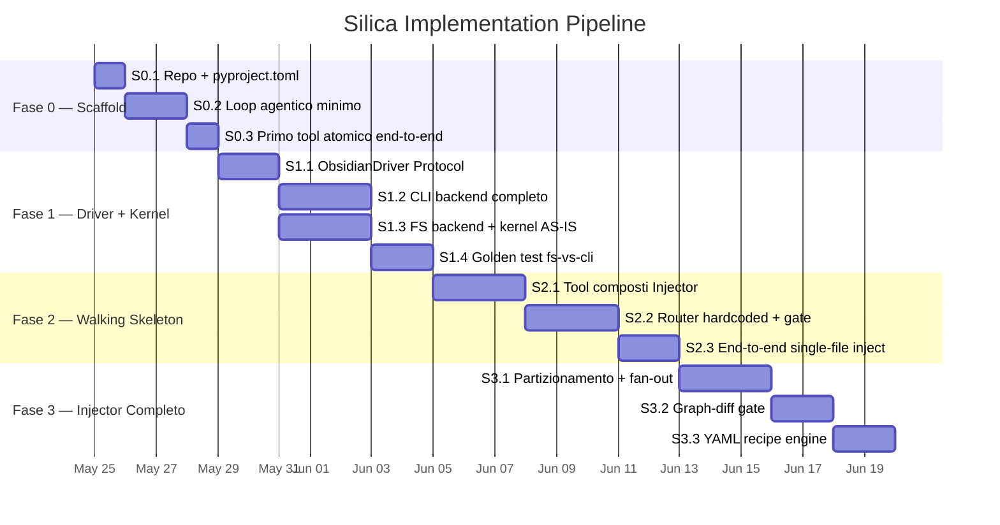

# Silica Agent — Analisi Architetturale e Pipeline Implementativa

> Revisione indipendente del charter SILICA.md.
> Data: 2026-05-24 · Reviewer: Architecture Framework

---

## 1. Verdetto Sintetico

L'architettura è **eccellente nella sua concezione**. I cinque strati (L0–L4) mappano in modo pulito la frase-filosofia, il principio dei due consumatori è il pivot corretto, e la strategia di non-regressione (doppio backend come oracolo) è un'idea che da sola vale il progetto. Ho identificato **4 rischi strutturali** e **6 decisioni cristallizzate** che meritano ADR formali, ma nessuno di questi invalida l'impianto — lo rafforzano.

---

## 2. Validazione delle Scelte Architetturali

### 2.1 L0 — Obsidian Driver (Protocol + due backend)

| Aspetto | Valutazione |
|---------|-------------|
| **Decisione** | Interfaccia `Protocol` con backend `cli` (primario) e `fs` (degradato + oracolo) |
| **Forza** | Due implementazioni dal giorno 1 → astrazione *onesta*, non leaky. Il backend `fs` come oracolo di regressione è brillante |
| **Rischio** | Il contratto di freshness read-after-write sul backend `cli` dipende dal timing della cache Electron — serve polling con timeout |

> [!TIP]
> **Confermato**: L'Obsidian CLI 1.12.7 è installata e funzionante sul sistema. Tutti i comandi necessari (`read`, `create`, `append`, `search`, `search:context`, `backlinks`, `links`, `orphans`, `unresolved`, `move`, `delete`, `properties`, `property:set`, `outline`, `history:restore`, `sync:restore`, `eval`, `base:query`, `files`) sono disponibili.

### 2.2 L1 — Kernel meccanico

| Aspetto | Valutazione |
|---------|-------------|
| **Decisione** | Funzioni pure, zero LLM, golden-testabili |
| **Forza** | Massima testabilità. Il codice Hermes (`ofm.py`, `frontmatter.py`, `templates.py`, `linter.py`) è già calibrato su golden notes |
| **Rischio** | Nessuno significativo — è la parte più solida |

### 2.3 L2 — Worker semantici

| Aspetto | Valutazione |
|---------|-------------|
| **Decisione** | Sub-agent stateless, JSON ops stretto, mai toccano il vault |
| **Forza** | Isolamento perfetto: il worker non può causare regressioni dirette |
| **Conferma** | `prep_delegation.py` già implementa prompt-verbatim + payload-by-pointer + SHA-256 checksum |

### 2.4 L3 — Router/Orchestrator

| Aspetto | Valutazione |
|---------|-------------|
| **Decisione** | Macchina a stati deterministica, LLM solo al confine dei worker |
| **Forza** | Elimina il non-determinismo dalla pipeline critica — il moat del progetto |
| **Rischio** | Complessità della FSM: servono stati di errore/retry ben definiti |

### 2.5 L4 — Ricette YAML

| Aspetto | Valutazione |
|---------|-------------|
| **Decisione** | Pipeline come DAG dichiarativo in YAML |
| **Forza** | Nuova pipeline = nuova ricetta, non nuovo codice |
| **Rischio** | Over-engineering prematuro se implementato prima del walking skeleton. **Raccomandazione**: fase 0-2 hardcoded, YAML a fase 3+ |

---

## 3. Architecture Decision Records (ADR)

### ADR-001: Obsidian CLI come backend primario (vs. filesystem diretto)

**Contesto**: Servono operazioni graph-safe (move aggiorna i wikilink) e accesso alla metadata-cache viva.

| Opzione | Pro | Contro |
|---------|-----|--------|
| CLI ufficiale | Graph-safe, cache viva, wikilink resolution | Richiede app desktop in esecuzione |
| Filesystem diretto | Indipendente, headless | Wikilink rotti su move, niente cache |
| Plugin API (via IPC) | Accesso completo | Non-standard, fragile |

**Decisione**: CLI ufficiale come primario, `fs` come degradato.
**Trade-off accettato**: Dipendenza dall'app desktop. Mitigazione: `fs` backend per headless, `xvfb` come opzione futura.
**Revisit trigger**: Se Obsidian rilascia un'API headless nativa.

### ADR-002: Invarianti nei tool wrapped (vs. system prompt)

**Contesto**: Le Golden Rule (anti-deletion, atomicità, OFM) devono essere enforced, non raccomandate.

**Decisione**: Le invarianti vivono nel codice dei tool wrapped e nel linter, non nel prompt.
**Rationale**: Un system prompt è una raccomandazione statistica; un `assert` nel tool è un invariante. Questo è il vantaggio competitivo rispetto ai copiloti reattivi.

### ADR-003: litellm per l'astrazione provider

**Decisione**: `litellm` per provider-agnostic function-calling.
**Rationale**: Supporta OpenRouter/Anthropic/OpenAI/locale, function-calling uniforme. Evita lock-in senza scrivere adapter custom.
**Trade-off**: Dipendenza aggiuntiva, ma il costo è minimo vs. scrivere il proprio router di provider.

### ADR-004: Pydantic per schema dei tool

**Decisione**: `BaseModel` per validazione + generazione JSON-schema automatica.
**Rationale**: Un singolo modello genera sia la validazione runtime sia lo schema che il modello vede. Elimina il drift schema-implementazione.

### ADR-005: Pipeline Injector come prima pipeline

**Decisione**: L'Injector è la prima pipeline, non Dedup o Refiner.
**Rationale**: (1) L'ingestione è la value proposition, (2) esercita l'arco completo L0→L4, (3) già specificata deterministicamente in `golden_pipeline_run.md`.

### ADR-006: Ricette YAML differite a fase 3

**Decisione**: Walking skeleton con pipeline hardcoded; YAML engine a fase 3+.
**Rationale**: Il rischio di over-engineering YAML prima di avere un loop funzionante è alto. Il walking skeleton valida l'architettura; il YAML la generalizza.

---

## 4. Rischi Strutturali e Mitigazioni

### R1 — Freshness della cache Obsidian (ALTO)

```
Scenario: create() → read() immediato → la cache non ha ancora propagato
```

**Mitigazione**: Implementare `_wait_for_settle(ref, timeout_ms=2000)` nel `cli_backend` che fa poll su `property:read` fino a convergenza. Testare con un golden test write→read.

### R2 — Tensione headless ↔ app-bound (MEDIO)

Il backend `cli` richiede l'app desktop. Per il cron unattended, serve o `xvfb` o il backend `fs` come first-class.

**Mitigazione**: Il backend `fs` è già pianificato. Differire la risoluzione a dopo il walking skeleton (§11 di SILICA.md, marcato *aperto*). Non blocca le fasi 0-3.

### R3 — Complessità del graph-diff (MEDIO)

`GraphSnapshot` richiede snapshot atomici di `orphans` + `unresolved` + `backlinks`/`links`. Se il vault è grande, il tempo di snapshot potrebbe essere significativo.

**Mitigazione**: Snapshot incrementale — catturare solo i nodi toccati dal batch, non l'intero grafo. Implementare a fase 3, non nel walking skeleton.

### R4 — Fan-out sub-agent e limiti di rate (BASSO)

`ThreadPoolExecutor` con max 7 worker → 7 chiamate LLM parallele. I provider possono rate-limitare.

**Mitigazione**: Backoff esponenziale nel `delegate.py`. Hard-stop a 10 task è già presente. Implementare a fase 3.

---

## 5. Matrice di Migrazione Hermes → Silica

### 5.1 File da copiare AS-IS → `silica/kernel/`

| Sorgente Hermes | Destinazione Silica | Note |
|-----------------|---------------------|------|
| [hermes_common/frontmatter.py](file:///home/kiycoh/Documents/dev/silica-agent/old_hermes_skills/hermes_common/frontmatter.py) | `silica/kernel/frontmatter.py` | 64 righe, maturo, calibrato |
| [hermes_common/ofm.py](file:///home/kiycoh/Documents/dev/silica-agent/old_hermes_skills/hermes_common/ofm.py) | `silica/kernel/ofm.py` | 155 righe, calibrato su golden notes |
| [hermes_common/templates.py](file:///home/kiycoh/Documents/dev/silica-agent/old_hermes_skills/hermes_common/templates.py) | `silica/kernel/templates.py` | 99 righe, `template_spoke` + `patch_snippet` |

### 5.2 Script da refactorare (I/O reinstradato su Driver)

| Script Hermes | Tool Silica | Cosa cambia |
|---------------|-------------|-------------|
| [recon.py](file:///home/kiycoh/Documents/dev/silica-agent/old_hermes_skills/obsidian-injector/scripts/recon.py) (370 righe) | `silica_recon` | `os.walk` → `DRIVER.search_context()`. Logica heuristica invariata |
| [distiller_payload.py](file:///home/kiycoh/Documents/dev/silica-agent/old_hermes_skills/obsidian-injector/scripts/distiller_payload.py) (409 righe) | `silica_payload` | `Path.read_text` → `DRIVER.read_note()` |
| [validate_operations.py](file:///home/kiycoh/Documents/dev/silica-agent/old_hermes_skills/obsidian-injector/scripts/validate_operations.py) (269 righe) | `silica_validate_ops` | `os.path.exists` → `DRIVER.read_note()` per check esistenza |
| [bulk_writer.py](file:///home/kiycoh/Documents/dev/silica-agent/old_hermes_skills/hermes_common/bulk_writer.py) (158 righe) | `silica_bulk_write` | `open(path, 'w')` → `DRIVER.create()` / `DRIVER.append()` |
| [linter.py](file:///home/kiycoh/Documents/dev/silica-agent/old_hermes_skills/hermes_common/linter.py) (149 righe) | `silica_lint` | `open(path, 'r')` → `DRIVER.read_note()` |
| [prep_delegation.py](file:///home/kiycoh/Documents/dev/silica-agent/old_hermes_skills/obsidian-injector/scripts/prep_delegation.py) (174 righe) | `silica_prep_delegation` | Pattern vendorizzato concettualmente |
| [parse_distiller_output.py](file:///home/kiycoh/Documents/dev/silica-agent/old_hermes_skills/obsidian-injector/scripts/parse_distiller_output.py) | `silica_sanitize` | Minimo refactor |
| [find_duplicates.py](file:///home/kiycoh/Documents/dev/silica-agent/old_hermes_skills/obsidian-dedup/scripts/find_duplicates.py) | `silica_find_duplicates` | `os.walk` → `DRIVER.search_names()` |

### 5.3 Da ignorare completamente

`acp_adapter`, `gateway`, `docker`, `trajectory_compressor`, `honcho`, `send_message_tool`, `browser_tool`, `discord_tool`, tutti i backend di esecuzione remoti, `skill_manager_tool`, `delegate_tool` (Hermes-specific).

---

## 6. Pipeline Implementativa — 14 Step Objective-Oriented



---

### Step 0.1 — Scaffold della repo

**Obiettivo**: `uv pip install -e .` → comando `silica` nel PATH.

**Deliverable**:
- `pyproject.toml` con `[project.scripts] silica = "silica.cli:main"`
- Struttura directory come §8.3 di SILICA.md (solo `__init__.py` vuoti)
- Dipendenze: `litellm`, `pydantic`, `prompt_toolkit`, `pyyaml`

**Criterio di accettazione**: `silica` si avvia e stampa il banner senza errori.

---

### Step 0.2 — Loop agentico minimo

**Obiettivo**: Il `while True` di §8.4 funziona con un provider LLM reale.

**Deliverable**:
- `silica/agent/loop.py` — il loop agentico
- `silica/agent/llm.py` — wrapper litellm
- `silica/tools/registry.py` — `@tool` decorator + `TOOLS` dict + `json_schema()`
- `silica/cli.py` — REPL con `prompt_toolkit`
- `silica/config.py` — model selection, vault path, API keys

**Criterio di accettazione**: `silica> ciao` → risposta dal modello. Nessun tool ancora.

---

### Step 0.3 — Primo tool atomico end-to-end

**Obiettivo**: `silica_read_note` funziona contro un vault Obsidian reale.

**Deliverable**:
- `silica/tools/atomic.py` — `silica_read_note` (wrapper su `obsidian read file=`)
- `silica/driver/base.py` — `ObsidianDriver` Protocol (stub)
- `silica/driver/cli_backend.py` — solo `read_note()` implementato

**Criterio di accettazione**: `silica> leggi la nota "Computer Vision"` → il modello chiama `silica_read_note`, riceve il contenuto, lo mostra.

---

### Step 1.1 — ObsidianDriver Protocol completo

**Obiettivo**: L'interfaccia di dominio è definita e tipizzata.

**Deliverable**:
- `silica/driver/base.py` con tutti i metodi del Protocol (§3 L0)
- Dataclass: `NoteRef`, `NoteContent`, `Hit`, `Heading`, `Link`, `GraphSnapshot`, `Txn`
- Contratto di freshness documentato

**Criterio di accettazione**: `mypy` passa sul Protocol. Nessuna implementazione ancora (solo firme).

---

### Step 1.2 — CLI backend completo

**Obiettivo**: Tutti i comandi Obsidian CLI mappati sui metodi del Driver.

**Deliverable**:
- `silica/driver/cli_backend.py` con tutti i metodi implementati
- Parsing JSON/TSV degli output CLI
- `_wait_for_settle()` per il contratto di freshness
- `_run_cli()` helper con error handling

**Criterio di accettazione**: Test manuale di ogni metodo contro vault reale. `search`, `read`, `create`, `move`, `delete`, `orphans`, `unresolved`, `backlinks`, `links`, `property:set` tutti funzionanti.

---

### Step 1.3 — FS backend + kernel AS-IS

**Obiettivo**: Il backend `fs` e il kernel meccanico funzionano.

**Deliverable**:
- `silica/driver/fs_backend.py` — filesystem diretto + indice in-memory
- `silica/kernel/frontmatter.py` — AS-IS da Hermes
- `silica/kernel/ofm.py` — AS-IS da Hermes
- `silica/kernel/templates.py` — AS-IS da Hermes (rimuovere bootstrap path hack)

**Criterio di accettazione**: `ofm.ofm_lint()` e `frontmatter.split()` passano gli stessi golden test di Hermes.

---

### Step 1.4 — Golden test fs-vs-cli

**Obiettivo**: Provare che i due backend producono gli stessi risultati.

**Deliverable**:
- `tests/golden/test_driver_parity.py`
- Fixture: vault di test con ~10 note
- Test: `search_names`, `read_note`, `links`, `backlinks`, `orphans` su entrambi i backend → assert output identico

**Criterio di accettazione**: `pytest tests/golden/` passa al 100%.

---

### Step 2.1 — Tool composti Injector

**Obiettivo**: I 6 script promossi funzionano come tool Silica.

**Deliverable**:
- `silica/tools/composed.py`:
  - `silica_recon` — refactor I/O di `recon.py` su Driver
  - `silica_payload` — refactor di `distiller_payload.py` su Driver
  - `silica_sanitize` — refactor di `parse_distiller_output.py`
  - `silica_validate_ops` — refactor di `validate_operations.py` su Driver
  - `silica_bulk_write` — refactor di `bulk_writer.py` su Driver
  - `silica_lint` — refactor di `linter.py` su Driver
- `silica/kernel/partition.py`, `silica/kernel/sanitize.py`, `silica/kernel/accept.py`

**Criterio di accettazione**: Ogni tool produce lo stesso output dello script Hermes originale sugli stessi input (golden test).

---

### Step 2.2 — Router hardcoded + gate

**Obiettivo**: L'Injector come FSM hardcoded con gate ≥10% e rollback.

**Deliverable**:
- `silica/router/orchestrator.py` — FSM con le 10 fasi di §7.3
- `silica/tools/wrapped.py` — `silica_move`, `silica_delete` con invarianti
- `silica_run_injector` — azione singola per l'agente
- `silica_snapshot` / `silica_restore` — via `history:restore`
- Gate ≥10% rigetti → abort + rollback

**Criterio di accettazione**: L'orchestrator esegue le 10 fasi in sequenza. Se il gate spara, rollback avviene e lo stato è ripristinato.

---

### Step 2.3 — End-to-end single-file inject

**Obiettivo**: Un concetto entra nel vault end-to-end con gate funzionante.

**Deliverable**:
- Test manuale: 1 file inbox → recon → payload → distill → sanitize → validate → snapshot → write → lint → cleanup
- Il gate ≥10% spara davvero su input cattivo
- Il rollback ripristina davvero

**Criterio di accettazione**: `silica> ingerisci l'inbox di oggi in Deep Learning` → nota creata/arricchita nel vault, file inbox spostato in `done/`.

---

### Step 3.1 — Partizionamento + fan-out

**Obiettivo**: Injector completo con partizionamento >200 concetti e fan-out parallelo.

**Deliverable**:
- `silica/agent/delegate.py` — `ThreadPoolExecutor` con max 7 worker
- `silica/kernel/partition.py` — partizionamento obbligatorio >200 concetti / >80KB
- Merge dei risultati multi-batch

**Criterio di accettazione**: Inbox con >200 concetti → partizionato automaticamente → distillato in parallelo → merge → validate → write.

---

### Step 3.2 — Graph-diff gate

**Obiettivo**: Non-regressione misurabile a livello di grafo.

**Deliverable**:
- `silica/kernel/graphdiff.py` — diff di due `GraphSnapshot`
- Gate: no nuovi orfani, no aumento unresolved, no backlink rotti
- Integrazione nel router come gate post-lint

**Criterio di accettazione**: Un batch che crea orfani → gate spara → rollback.

---

### Step 3.3 — YAML recipe engine

**Obiettivo**: Pipeline come ricette YAML dichiarative.

**Deliverable**:
- `silica/router/recipe_parser.py` — parser del YAML §4 L4
- `recipes/injector.yaml` — l'Injector come ricetta
- Il router esegue la ricetta invece del codice hardcoded

**Criterio di accettazione**: `recipes/injector.yaml` produce gli stessi risultati del router hardcoded di step 2.2.

---

## 7. Grafo delle Dipendenze

```mermaid
graph TD
    S01[S0.1 Scaffold] --> S02[S0.2 Loop agentico]
    S02 --> S03[S0.3 Primo tool]
    S03 --> S11[S1.1 Driver Protocol]
    S11 --> S12[S1.2 CLI backend]
    S11 --> S13[S1.3 FS backend + kernel]
    S12 --> S14[S1.4 Golden test parity]
    S13 --> S14
    S14 --> S21[S2.1 Tool composti]
    S21 --> S22[S2.2 Router + gate]
    S22 --> S23[S2.3 E2E single-file]
    S23 --> S31[S3.1 Partition + fanout]
    S23 --> S32[S3.2 Graph-diff]
    S31 --> S33[S3.3 YAML engine]
    S32 --> S33

    style S03 fill:#2d5016,stroke:#4ade80
    style S23 fill:#7c2d12,stroke:#f97316
    style S33 fill:#1e3a5f,stroke:#60a5fa
```



**Legenda**: 🟢 S0.3 = prima prova di vita · 🟠 S2.3 = walking skeleton completo · 🔵 S3.3 = architettura completa

---

## 8. Raccomandazioni Finali

1. **Non scrivere il YAML engine prima del walking skeleton** (ADR-006). Il rischio di over-engineering è reale.
2. **Implementare `_wait_for_settle()`** nel CLI backend dal giorno 1 — il contratto di freshness è normativo.
3. **Il test fs-vs-cli (S1.4) è il checkpoint architetturale più importante**. Se i due backend divergono, l'astrazione è leaky e tutto ciò che segue è costruito su sabbia.
4. **Tenere i golden test di Hermes** come fixture di regressione — sono il patrimonio ereditato più prezioso.
5. **Differire il cron/report sink** (Fase 5 di SILICA.md) — non blocca nulla e dipende dalla risoluzione della tensione headless.
